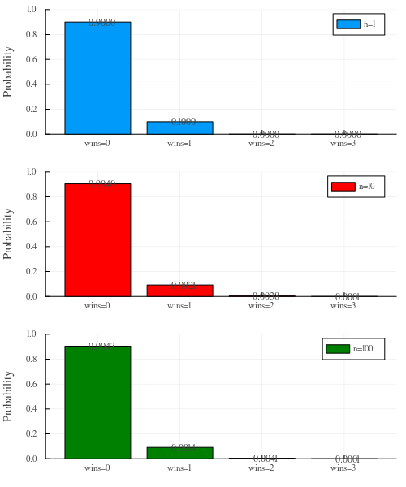
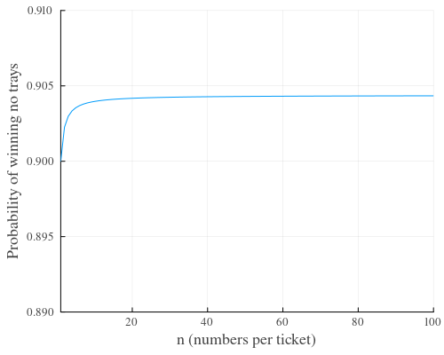

#+title: Meat raffle probabilities
#+author: James
#+date: 6 Sep, 2026
#+setupfile: post.setup
#+include: header.org

Last week I found myself at The Builder's club for dinner to celebrate Andy's Australian citizenship. The club was running a meat raffle that had some interesting statistics to it.

For $5 you would be given a ticket with 50 numbers, $10 gives you 100 numbers and so on (10 entries per dollar). I wondered why not have $5 per single entry, wouldn't it be the same? Actually not, since you can now win multiple meat trays.

* Hypothesis

My hypothesis is that receiving a large number of entries increases the chance of winning zero meat trays.

I'm also hypothesising that the expected value has no change (the loss in chance of winning zero is made up in the chance to win 2, or 3, or more).

* Notation

Let's use the following notation:

- $t$ = number of tickets (entries)
- $n$ = numbers per ticket
- $N$ = total numbers ($N = tn$)
- $z$ = number of prizes

We will also need the combination function; the number of distinct ways to select $k$ elements from a set of $n$ elements is $C^n_k = \frac{n!}{k!(n-k)!}$.

* Chances

In order to win zero prizes, we can determine the number of combinations that don't include our $e$ numbers divides by the total number of combinations:

$p(win=0) = C^{N-n}_z / C^N_z$

If everyone has $n=1$ number, there are $t=100$ players ($N=100$), and $z=10$ trays, we get:

$p(wins=0) = C^{100-1}_{10} / C^{100}_{10} = 0.9000$

$p(wins=1) = 0.1000$

If everyone has $n=10$ numbers, there are $t=100$ players ($N=1000$), and $z=10$ trays, we get:

$p(wins=0) = C^{1000-10}_{10} / C^{1000}_{10} = 0.9040$

$p(wins=1) = C^{10}_1 C^{990}_9 / C^{1000}_{10} = 0.0921$

$p(wins=2) = C^{10}_2 C^{990}_8 / C^{1000}_{10} = 0.0038$

This generalises to:

$p(wins=k) = C^n_k C^{N-n}_{z-k} / C^N_z$

or

$p(wins \ge k) = 1 - \sum^{k-1}_{i=0} {C^n_i C^{N-n}_{z-i} / C^N_z}$

* Graph

Given the number of tickets is $t=100$, and number of trays to win is $z=10$ trays, the following shows the probabilies for 1, 10 and 100 number per ticket. As predicted the probability of no trays increases but for the case of $n=10$ and $n=100$ the probability for 2 or more wins becomes higher. Note that when $n=1$ the probability of 2 or more wins is zero.

Given the number of tickets is $t=100$, and number of trays to win is $z=10$ trays, the following shows the probability of winning no trays. As predicted the probability of no trays increases as the numbers $n$ increases (although it's pretty marginal, noting the axes do not start at zero).

